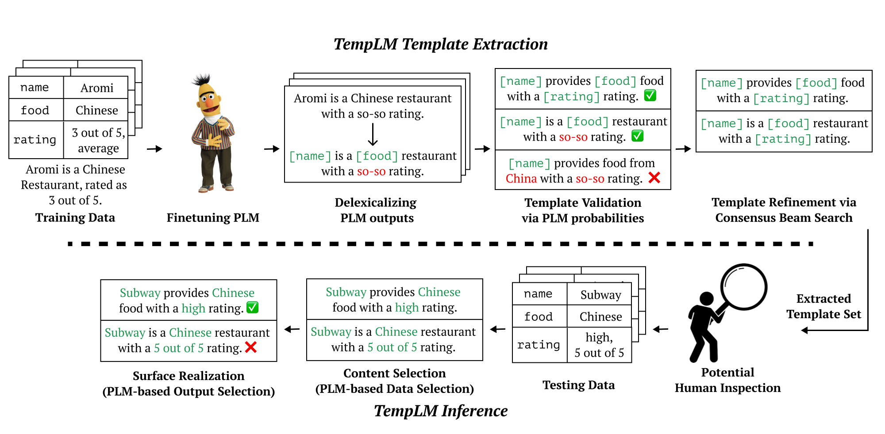

# TempLM
[](#python)
[](https://arxiv.org/abs/2205.11055)
[](https://opensource.org/licenses/MIT) 


This repo currently implements the experiments in the paper ["TempLM: Distilling Language Models into Template-Based Generators"](https://arxiv.org/abs/2205.11055).

#### Authors:
* [Tianyi Zhang](https://tiiiger.github.io/)
* [Mina Lee*](https://minalee.info/)
* [Xiang Lisa Li*](https://xiangli1999.github.io/)
* Ende Shen*
* [Tatsunori Hashimoto](https://thashim.github.io/)

## Overview

This repo implements the experiments in the paper ["TempLM: Distilling Language Models into Template-Based Generators"](https://arxiv.org/abs/2205.11055).
TempLM distills pretrained language models into template-based generators to achieve faithfulness and interpretability.
For an illustration,


If you find this repo useful, please cite:
```
@article{Zhang2022TempLMDL,
  title={TempLM: Distilling Language Models into Template-Based Generators},
  author={Tianyi Zhang and Mina Lee and Xiang Lisa Li and Ende Shen and Tatsunori Hashimoto},
  journal={ArXiv},
  year={2022},
  volume={abs/2205.11055}
}
```

## Dependencies
Basic packages are listed in `requirements.txt` and the full specification is in `requirements_full.txt`

## Data
- E2E text generation dataset: this will be downloaded via the huggingface dataset package. You do not need to download E2E manually. We also extract and sorted the E2E dev and test sets at `./e2e_data`.
- SynthBio: this dataset is included with our repo under `./synthbio`. We create our own test, train, and validation splits from the original dataset.

## Usage

You can also download the all pretrained models ([link](https://drive.google.com/file/d/1jiZlN1H4uz9DRn5m63RdOIZrK0isQ71y/view?usp=sharing)). The uncompressed folder should look like:
```
├── e2e
│   ├── delex_bart
│   ├── delex_gt
│   ├── infill_models
│   ├── refine
│   └── seq2seq_models
└── synthbio
    ├── delex_bart
    ├── delex_gt
    ├── infill_models
    ├── refine
    └── seq2seq_models
```


### E2E Experiments
You should either set up environment variables or modify the released scripts to specify paths to data and model checkpoints.
```bash
export DIR=<path to this directory>
export OUT=<top level dir of experiment output> # will look like the downloaded folder if you run all the commands detailed below
```

To run evaluation, you should clone the official E2E evaluation repo. For example,
```
cd $DIR
git clone https://github.com/tuetschek/e2e-metrics.git
```
To replicate experiments on the E2E dataset: 
1. Finetune a Seq2Seq BART model `./scripts/e2e/fewshot/train_seq2seq.sh`
2. Finetune an infilling BART model `./scripts/e2e/fewshot/train_infill.sh`
3. Extract templates by delexicializing BART outputs and keep the topk candidates `./scripts/e2e/fewshot/delex_bart_select.sh`
4. Refine templates `./scripts/e2e/fewshot/refine.sh`
5. Evaluate on test and validation `./scripts/e2e/fewshot/eval_seq2seq.sh`
6. Refer to `$OUT/e2e/fewshot/s1/dev_output/metrics.txt` for the generated metric scores
7. Automatic faithfulness evaluation `/scripts/e2e/fewshot/fact_check.sh`. Some commands are commented out and can be added back for evaluating other baselines.

For two baselines reported in the paper, delexicalizing training data and all model outputs, replace 3 and 4 with `delex_gt.sh` or `delex_bart.sh`.
To evaluate the finetuned BART model, refer to `./scripts/e2e/eval_seq2seq.sh`.

### SynthBio Experiments
Similar to the procedure described above:
1. Finetune a Seq2Seq BART model `./scripts/synthbio/train_seq2seq.sh`
2. Finetune an infilling BART model `./scripts/synthbio/train_infill.sh`
3. Extract templates by delexicializing BART outputs and keep the topk candidates `./scripts/synthbio/delex_bart_select.sh`
4. Refine templates `./scripts/synthbio/refine.sh`
5. Evaluate on test and validation `./scripts/synthbio/eval_seq2seq.sh`
6. Refer to `$OUT/synthbio/s1/dev_output/metrics.txt` for the generated metric scores

## File structure of this repo
1. `*_args.py` files organize argument parsers we used in different experiments. `*_utils.py` contain miscellaneous helper functions.
2. Data related code
   1. `data.py` implements the `TabularData` file structure, which implements the clustering of input data tables.
   2. `preprocessing.py` processes the text descriptions in these datasets into standard formats
   3. `field_transformation.py` implements auxiliary transfomrations to the input data that enable stronger template systems.
   4. `./datasets/synthbio.py` helps load the SynthBio dataset into the huggingface format.
3. Model training code
   1. `train_seq2seq.py` finetunes a BART model for left to right decoding.
   2. `train_infill.py` finetunes a BARAT model for infilling.
4. Template extraction code
   1. `template_search.py` implements template extraction with delexicalization.
   2. `template_refinement.py` implements refining templates with an infilling model.
   3. `template_search_bart.py` implements the consensus beam search algorithm for generating templates with an infilling model.
5. Evaluation code
   1. `eval_baselines.py` for BART decoding
   2. `eval_e2e_templates.py` for template inference on E2E
   2. `eval_synthbio_templates.py` for template inference on SynthBio
